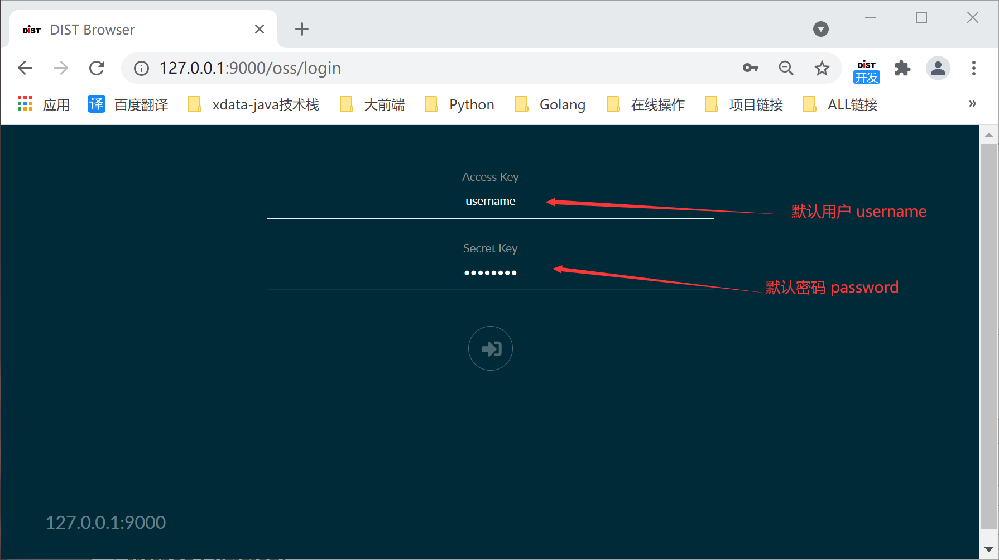
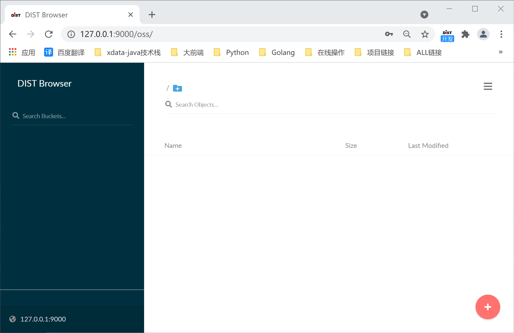
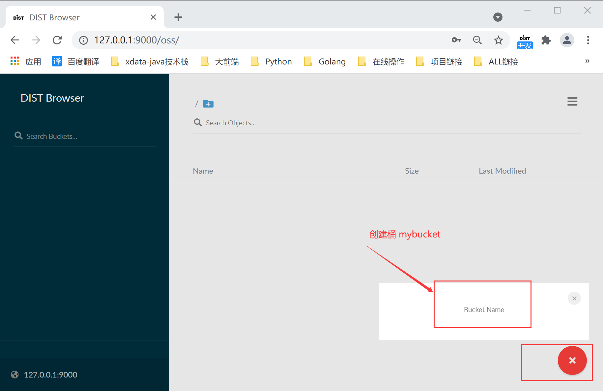
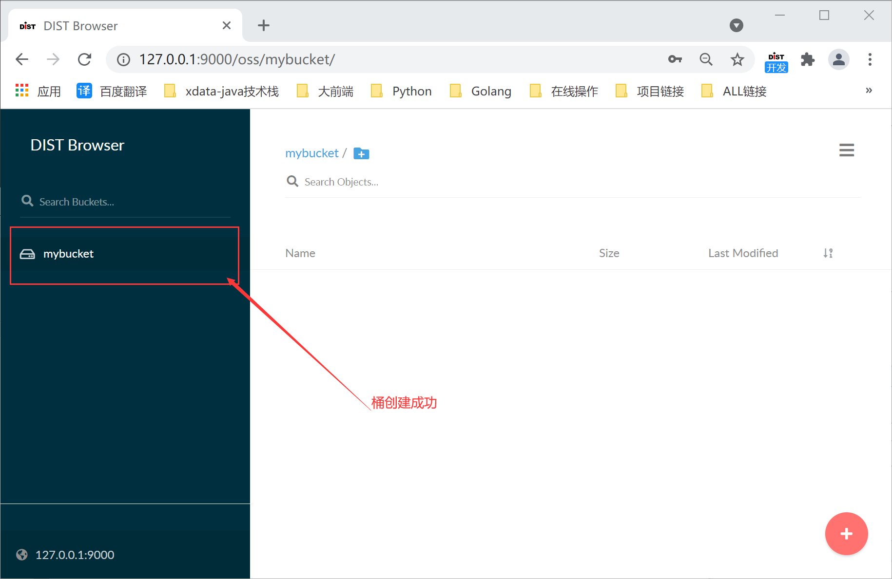
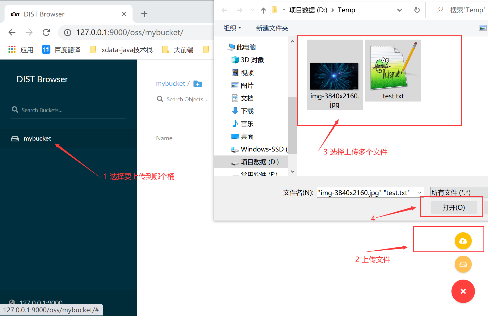
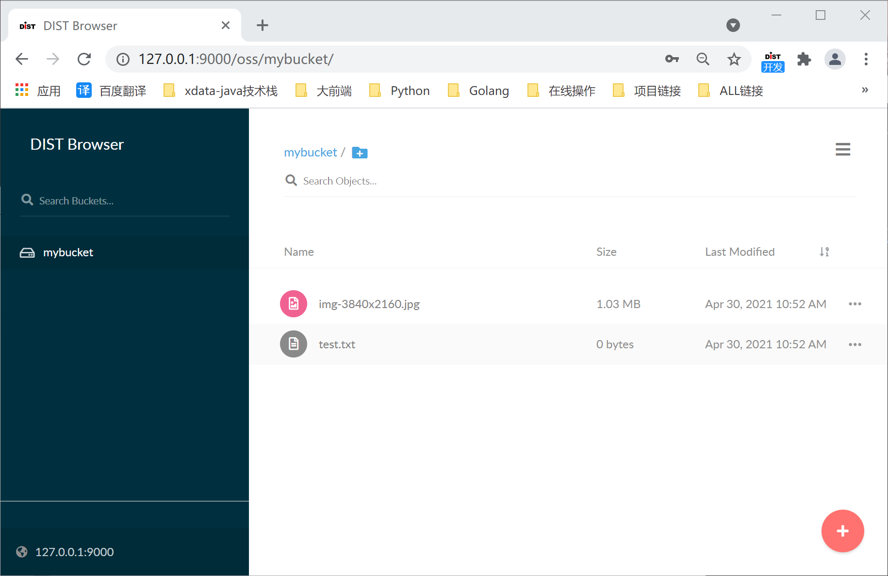
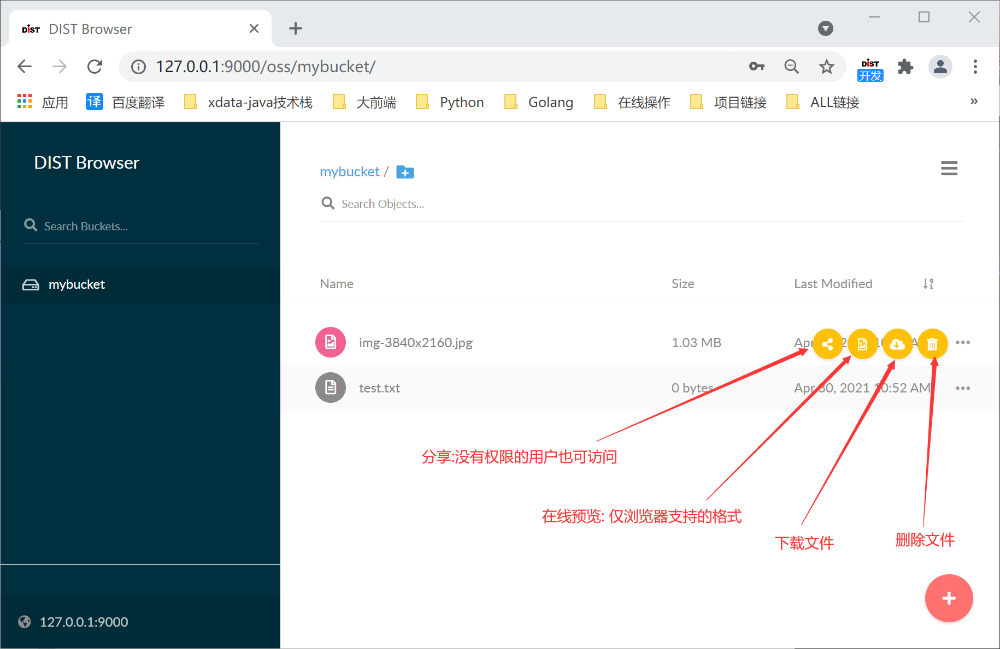
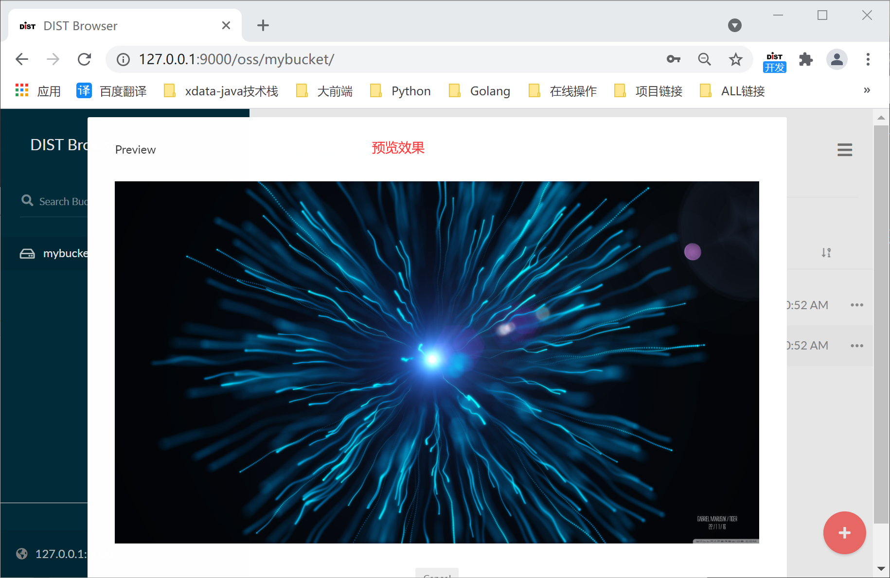
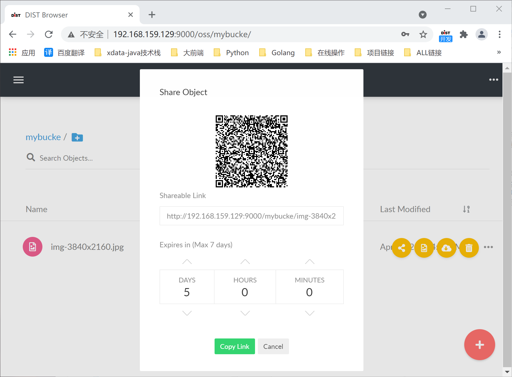
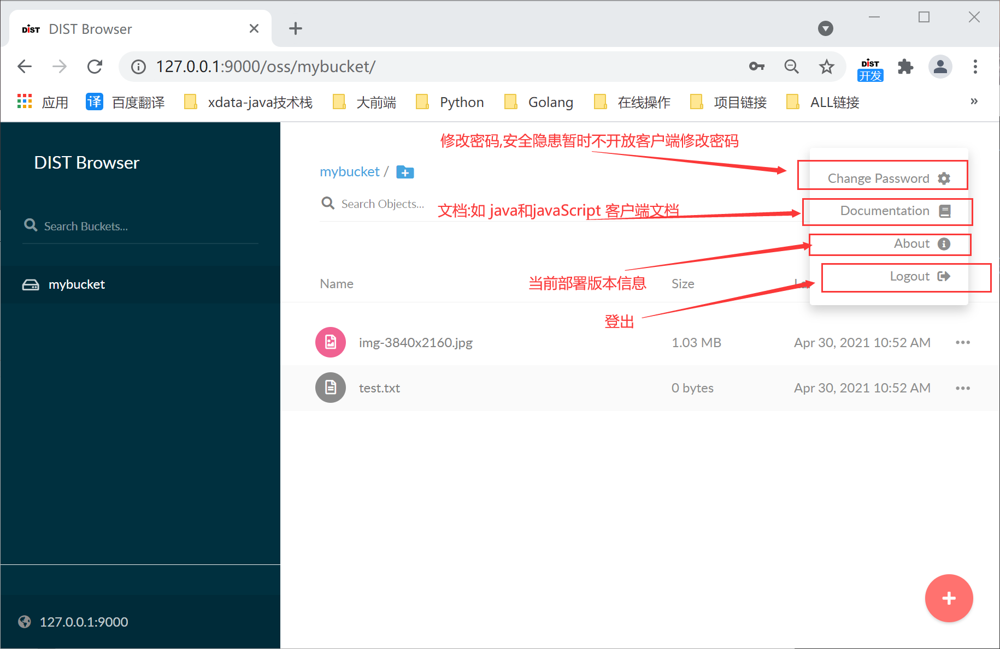

# OSS 部署文档


## OSS简要说明

OSS是一个对象存储服务。它兼容亚马逊S3云存储服务接口，非常适合于存储大容量非结构化的数据，例如图片、视频、日志文件、备份数据和容器/虚拟机镜像等，而一个对象文件可以是任意大小，从几kb到最大5T不等。

OSS是一个非常轻量的服务,可以很简单的和其他应用的结合，类似 NodeJS, Redis 或者 MySQL Postgresql 等

支持部署方式: `docker` `linux` `mac` `windows` 等环境

设计理念遵从 :  [**Amazon S3**](https://docs.aws.amazon.com/zh_cn/AmazonS3/latest/userguide/Welcome.html)    ,快速了解 OSS对象文件存储模式.


## OSS 开发文档

- [Java Client API Reference-English ](http://elb-791125809.cn-northwest-1.elb.amazonaws.com.cn:5335/zhengja/oss-docs/-/blob/master/docs/Java%20Client%20API%20Reference.md)   
- [Java Client API参考文档-中文](http://elb-791125809.cn-northwest-1.elb.amazonaws.com.cn:5335/zhengja/oss-docs/-/blob/master/docs/Java%20Client%20API%E5%8F%82%E8%80%83%E6%96%87%E6%A1%A3.md)   
- [JavaScript Client API Reference-English](http://elb-791125809.cn-northwest-1.elb.amazonaws.com.cn:5335/zhengja/oss-docs/-/blob/master/docs/JavaScript%20Client%20API%20Reference.md)  
- [JavaScript Client API参考文档-中文](http://elb-791125809.cn-northwest-1.elb.amazonaws.com.cn:5335/zhengja/oss-docs/-/blob/master/docs/JavaScript%20Client%20API%E5%8F%82%E8%80%83%E6%96%87%E6%A1%A3.md)


## Docker 容器

### 稳定版

```bash
# 公司私有habor镜像

docker pull oss/oss
docker run -p 9000:9000 oss/oss server /data
```

### 下载Dokcer镜像文件

> 手动下载镜像,并导入docker启动

| 操作系统 | CPU架构      | 最新版本地址                                                 |
| :------- | :----------- | :----------------------------------------------------------- |
| Docker   | 64-bit Intel | http://elb-791125809.cn-northwest-1.elb.amazonaws.com.cn:5335/zhengja/oss-docs/-/tree/master/server/oss/release/docker-image/oss |

```sh
docker pull oss/oss
docker run -p 9000:9000 oss/oss server /data
```


## macOS

### 下载二进制文件

| 操作系统    | CPU架构      | 最新版本地址                                                 |
| :---------- | :----------- | :----------------------------------------------------------- |
| Apple macOS | 64-bit Intel | http://elb-791125809.cn-northwest-1.elb.amazonaws.com.cn:5335/zhengja/oss-docs/-/tree/master/server/oss/release/darwin-amd64/oss |

```sh
chmod 755 oss
./oss server /data
```


## GNU/Linux

### 下载二进制文件

| 操作系统  | CPU架构      | 最新版本地址                                                 |
| :-------- | :----------- | :----------------------------------------------------------- |
| GNU/Linux | 64-bit Intel | http://elb-791125809.cn-northwest-1.elb.amazonaws.com.cn:5335/zhengja/oss-docs/-/tree/master/server/oss/release/linux-amd64/oss |

```sh
chmod +x oss
./oss server /data
```


## 微软Windows系统

### 下载二进制文件

| 操作系统        | CPU架构 | 最新版本地址                                                 |
| :-------------- | :------ | :----------------------------------------------------------- |
| 微软Windows系统 | 64位    | http://elb-791125809.cn-northwest-1.elb.amazonaws.com.cn:5335/zhengja/oss-docs/-/tree/master/server/oss/release/windows-amd64/oss.exe |

```bash
oss.exe server D:\data
```


## 使用DIST OSS 内置浏览器进行验证

安装后使用浏览器访问[http://127.0.0.1:9000](http://127.0.0.1:9000/)，如果可以访问，则表示oss已经安装成功

### 效果图展示图






















以上仅仅是可视化页面端的功能体现, 还有很多功能是api提供的, 无法通过页面体现出来, 比如, 对象文件版本管理,支持上传文件夹等功能.